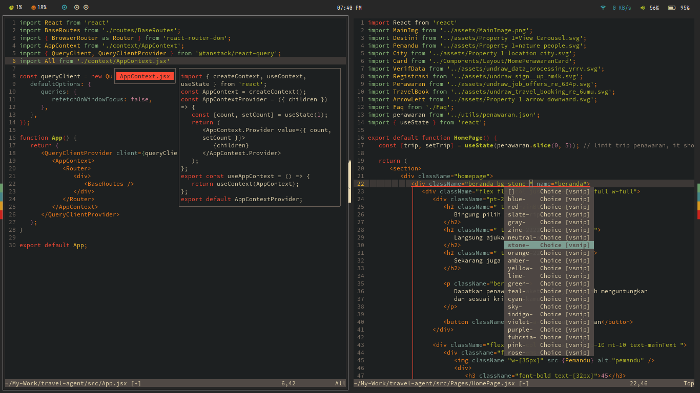

<h1 align="center">Znvim</h1>
<p align="center">Neovim config designed for frontend dev</p>

<p align="center">
   
   
   
   
   
   
   
</p>



<p align="center">
    <a href="https://github.com/Zeddnyx/Znvim">
      
    </a>
</p>

## Install

clean up your config first

```
rm -rf ~/.local/share/nvim
rm -rf ~/.cache/nvim
```

install

```
git clone https://github.com/ZeddNyx/Znvim ~/.config/nvim

```

run `nvim`

## List plugin

- Lsp configuration with [lsp ](https://github.com/neovim/nvim-lspconfig) and [lspkind](https://github.com/onsails/lspkind.nvim)
- Autocompletion with [cmp](https://github.com/hrsh7th/nvim-cmp)
- Autoclosing braces with [autopairs](https://github.com/windwp/nvim-autopairs)
- Themes with [gruvbox](https://github.com/ellisonleao/gruvbox.nvim)
- Syntax highlighting with [treesitter](https://github.com/nvim-treesitter/nvim-treesitter)
- Comment syntax with [comment](https://github.com/numToStr/Comment.nvim)
- Indentlines with [indent blankline](https://github.com/lukas-reineke/indent-blankline.nvim)
- Custome Snippets with [vsnip](https://github.com/hrsh7th/cmp-vsnip)
- Color preview with [colorizer](https://github.com/NvChad/nvim-colorizer)
- Find files with [Telescope](https://github.com/nvim-telescope/telescope.nvim)

## Keybind

```
Space + ff - telescope find files
Space + fg - telescope live grep
Space + fb - telescope find buffer

Space + h - switch left
Space + l - switch right
Space + k - switch up
Space + j - switch down

Space + e - file manager ('q' close file manager)
Space + a - select all
Space + s - find all replace all
Space + d - find exact word

Shift + h - buffer previous
Shift + l - buffer next
Shift + c - buffer close
Shift + q + o' - buffer close all except this one

Shift + f - prettier
```
## Thanks

- [Vim Indonesia](https://t.me/VimID)

## Uninstall

```
# linux/macos (unix)
rm -rf ~/.local/share/nvim
rm -rf ~/.config/nvim
rm -rf ~/.cache/nvim

# windows
rd -r ~\AppData\Local\nvim
rd -r ~\AppData\Local\nvim-data
```
