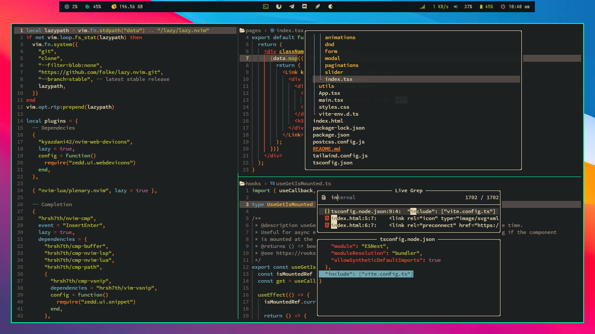
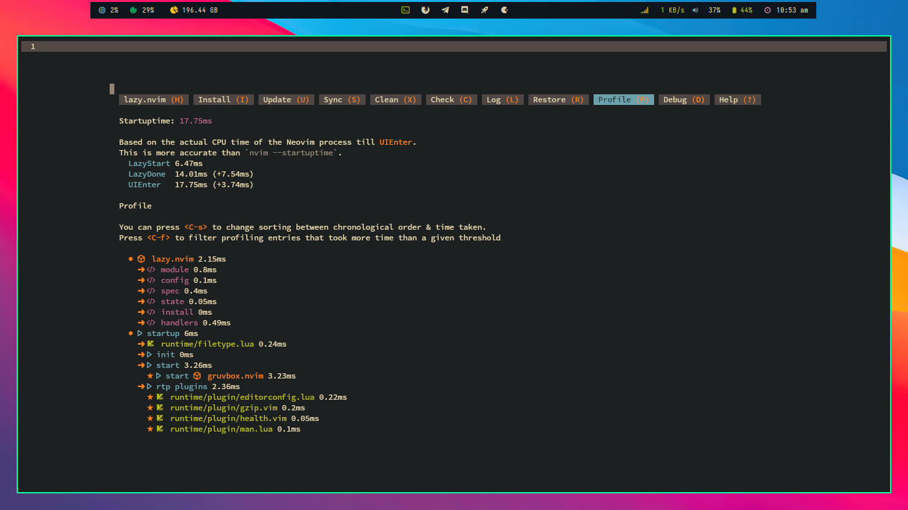

## Znvim
### Neovim config designed for Frontend Development

<p align="start">
   
   
   
   
   
  <!--   -->
</p>




<p align="center">
    <a href="https://github.com/Zeddnyx/Znvim">
      
    </a>
</p>

## Plugin
<details>

| Name                  | Plugin                                                                  |
|-----------------------|-------------------------------------------------------------------------|
| Auto Pilot            | [Codeium](https://github.com/Exafunction/codeium.vim)                   |
| Autocompletion        | [Cmp](https://github.com/hrsh7th/nvim-cmp)                              |
| Autoclosing Braces    | [Autopairs](https://github.com/windwp/nvim-autopairs)                   |
| Bars                  | [Bar](https://github.com/romgrk/barbar.nvim)                            |
| Custome Snippet       | [Vsnip](https://github.com/hrsh7th/cmp-vsnip)                           |
| Color Preview         | [Colorizer](https://github.com/NvChad/nvim-colorizer)                   |
| Find Files            | [Telescope](https://github.com/nvim-telescope/telescope.nvim)           |
| Gitsigns              | [Gitsigns](https://github.com/lewis6991/gitsigns.nvim)                  |
| Indentlines           | [Indentlines ](https://github.com/lukas-reineke/indent-blankline.nvim)  |
| Lsp                   | [Lsp](https://github.com/neovim/nvim-lspconfig)                         |
| Nulls                 | [Null-ls](https://github.com/jose-elias-alvarez/null-ls.nvim)           |
| Syntax Highlighting   | [Treesitter](https://github.com/nvim-treesitter/nvim-treesitter)        |
| Themes                | [Gruvbox](https://github.com/Zeddnyx/gruvbox.nvim)                      |
| File Navigation       | [NvimTree](https://github.com/kyazdani42/nvim-tree.lua)                 |
</details>

## Install

clean up your config first
```
rm -rf ~/.local/share/nvim
rm -rf ~/.cache/nvim
```

install prettier, stylua (optional)
```
npm i -g prettier @johnnymorganz/stylua-bin

```

install
```
git clone https://github.com/ZeddNyx/Znvim ~/.config/nvim

```

run `nvim`


## Keybindings

Space (SPC) is my Leader key.

<details>
<summary>Telescope</summary>

| Key Bindings | Description                   |
|--------------|-------------------------------|
| SPC ff       | Telescope find files          |
| SPC fg       | Telescope live grep           |
| SPC fb       | Telescope buffers             |
| SPC gg       | Telescope git commit          |
| SPC gs       | Telescope git status          |
| SPC lf       | Telescope lsp references      |
| SPC ll       | Telescope lsp definitions     |
</details>

<details>
<summary>Comment</summary>

| Key Bindings | Description          |
|--------------|----------------------|
| crr          | Comment jsx          |
| cr (visual)  | Comment jsx          |
| ur (visual)  | Uncomment jsx        |
|              |                      |
| cjj          | Comment js           |
| cj (visual)  | Comment js           |
| uj (visual)  | Uncomment js         |
|              |                      |
| css          | Comment css          |
| cs (visual)  | Comment css          |
| uc (visual)  | Uncomment css        |
|              |                      |
| cll          | Comment lua          |
| cl (visual)  | Comment lua          |
| ul (visual)  | Uncomment lua        |
</details>
  
<details>
<summary>Buffers </summary>
  
| Key Bindings | Description      |
|--------------|------------------|
| Shift h      | Buffer previous  |
| Shift l      | Buffer next      |
| Shift c      | Buffer close     |
| Shift q      | Buffer close all |
</details>
  
<details>
<summary>Lsp</summary>

| Key Bindings | Description      |
|--------------|------------------|
| Shift k      | Hover doc        |
| Shift j      | Previewd efinition |
| Shift r      | Rename           |
</details>

<details>
<summary>Custome & Other</summary>

| Key Bindings | Description             |
|--------------|-------------------------|
| SPC h        | Switch left             |
| SPC j        | Switch down             |
| SPC k        | Switch up               |
| SPC l        | Switch right            |
|              |                         |
| SPC a        | Select all              |
| SPC c        | Clean higlight          |
| SPC e        | File explorer           |
| SPC s        | Find specific word      |
| SPC ss       | Find and replace all    |
| SPC y        | Copy forward word       |
|              |                         |
| SPC ww       | Save file               |
| SPC wa       | Save all file           |
| SPC wq       | Save and quit           |
| SPC qq       | quit nvim               |
|              |                         |
| Shift f      | Prettier                |
| Ctrl g       | Apply Codeium Reference |
</details>


## Thanks

- [Vim Indonesia](https://t.me/VimID)

## Uninstall

```
# linux/macos (unix)
rm -rf ~/.local/share/nvim
rm -rf ~/.config/nvim
rm -rf ~/.cache/nvim

# windows
rd -r ~\AppData\Local\nvim
rd -r ~\AppData\Local\nvim-data
```
