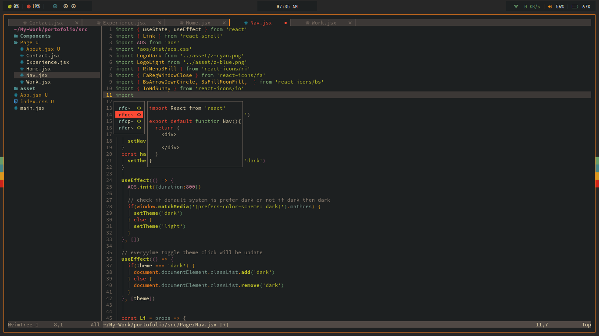
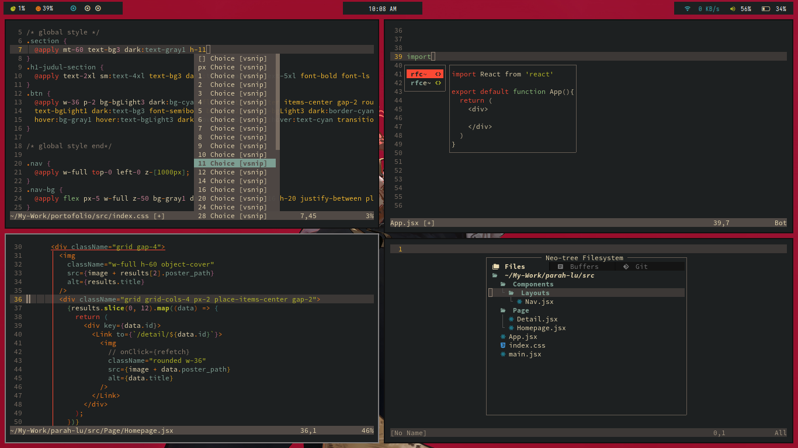

# Znvim

Neovim for frontend dev
(HTML, CSS, Tailwindcss, JavaScript, ReactJS, TypeScript, NextJS)





## Install
clean up your config first
```
rm -rf ~/.local/share/nvim
rm -rf ~/.cache/nvim
```
install
```
git clone https://github.com/ZeddNyx/Znvim ~/.config/nvim

```

run `nvim` and type `:Lazy`

## List plugin

- Lsp configuration with [lsp ](https://github.com/neovim/nvim-lspconfig) and [lspkind](https://github.com/onsails/lspkind.nvim)
- Autocompletion with [cmp](https://github.com/hrsh7th/nvim-cmp)
- Autoclosing braces with [autopairs](https://github.com/windwp/nvim-autopairs)
- Themes with [gruvbox](https://github.com/ellisonleao/gruvbox.nvim)
- Syntax highlighting with [treesitter](https://github.com/nvim-treesitter/nvim-treesitter)
- Comment syntax with [comment](https://github.com/numToStr/Comment.nvim)
- Indentlines with [indent blankline](https://github.com/lukas-reineke/indent-blankline.nvim)
- Snippets with [vsnip](https://github.com/hrsh7th/cmp-vsnip)
- Color preview with [colorizer](https://github.com/NvChad/nvim-colorizer)

## Keybind

```
// Comment
'gcc' -- Normal mode
'gc'  -- Visual mode

// Buffer
'Shift + h' -- Move previous
'Shift + l' -- Move next
'Shift + c' -- Close buffer

'Space + e' -- File navigation
'Space + f' -- Format and prettier
'Space + s' -- Find and replace all word match
'Shift + s' -- Select all
```

## Thanks

- [AdiCahyaSaputra](https://github.com/AdiCahyaSaputra)
- [Vim Indonesia](https://t.me/VimID)

## Uninstall

```
# linux/macos (unix)
rm -rf ~/.local/share/nvim
rm -rf ~/.config/nvim
rm -rf ~/.cache/nvim

# windows
rd -r ~\AppData\Local\nvim
rd -r ~\AppData\Local\nvim-data
```
